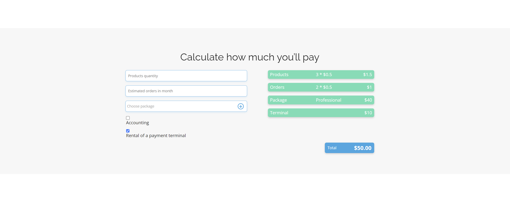

# BestShop - Online Store Management Landing Page

This repository contains the source code for a landing page created for a company offering online store management services and corresponding software. The project was developed as part of a JavaScript course and showcases various web development skills and technologies.

## Features

- **Contact Form**: A form to capture visitor information and inquiries.
- **Interactive Price Calculator**: A tool to calculate service costs based on user inputs.
- **Responsive Design**: The page is fully responsive, ensuring it looks great on all devices.

## Technologies Used

- **HTML**: Structure of the webpage.
- **CSS**: Basic styling of the webpage.
- **SASS**: Advanced CSS preprocessor for more efficient and organized styling.
- **JavaScript**: Interactivity and dynamic content management.

## Getting Started

To view the project locally, follow these steps:

1. **Clone the repository**:
   ```bash
   git clone https://github.com/AniaStep/BestShop.git
   ```
2. **Navigate to the project directory**:
   ```bash
   cd BestShop
   ```
3. **Open index.html in your web browser**:

## Demo

Check out the live demo of the project [here](#).

## Screenshots


